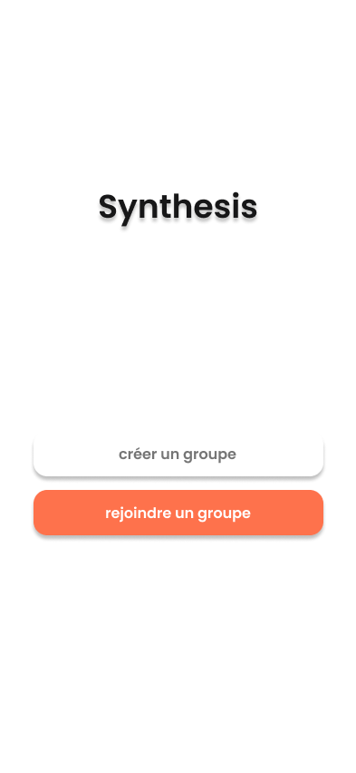

# Synthesis

**Synthesis** is an application developed as part of a school project. It has been realized with the Flutter framework.
The course is given in French, you will find all the details of the application in French.

## Description

L'application Synthesis est destiné aux étudiants. Le but de celle-ci est de créer ou rejoindre facilement des groupes
dans lesquels tout est centralisé.
Effectivement, on va retrouver dans un groupe toute une liste de cours. Pour chaque cours,
on y retrouve les ressources officielles, mais ce n'est pas tout : les étudiants peuvent y partager leur notes, leur
synthèse ou encore des photos prisent durant le cours. En plus de cela, un étudiant en difficulté
peut poser ses questions via un chat dédié au cours qui lui pose un problème.

## Design

Le design de l'application a été réalisé à l'aide de l'outil
[Figma](https://www.figma.com). Vous pouvez accéder au **mockup** de
l'application via ce [lien](https://www.figma.com/file/zMKzLaDnktYNdJXcdXekuK/Synthesis?node-id=0%3A1).

  
   
  

  
   
  

  
   
  

  
   
  

## Site Map
La carte de l'application a également été réalisé avec [Figma](https://www.figma.com). Voici ci-dessous l'ensemble des
intéractions possible au sein de l'application. Afin d'**intéragir** avec les maquettes
réalisées vous pouvez clicker sur ce [lien](https://www.figma.com/proto/zMKzLaDnktYNdJXcdXekuK/Synthesis?node-id=5%3A159&scaling=scale-down&page-id=0%3A1&starting-point-node-id=5%3A159).

## Fonctionnalités
- En tant qu'**anonyme**, je peux me connecter via l'application.
- En tant qu'**anonyme**, je peux me connecter à l'application via **Google**.
- En tant qu'**utilisateur connecté**, je peux rejoindre un groupe.
- En tant qu'**utilisateur connecté**, je peux créer groupe.
- En tant qu'**utilisateur connecté**, je peux accéder au contenu d'un groupe.
- En tant qu'**utilisateur connecté**, je peux partager le code du groupe.
- En tant qu'**utilisateur connecté**, je peux consulter la liste des membres du groupe.
- En tant qu'**utilisateur connecté**, je peux ajouter un cours à un groupe.
- En tant qu'**utilisateur connecté**, je peux ajouter/consulter une ressource pour un cours.
- En tant qu'**utilisateur connecté**, je peux ajouter/consulter une note pour un cours.
- En tant qu'**utilisateur connecté**, je peux ajouter/consulter une photo pour un cours.
- En tant qu'**utilisateur connecté**, je peux poser une question via le chat du cours dédié.
- En tant qu'**utilisateur connecté**, je peux télécharger une ressource d'un cours.
- En tant qu'**utilisateur connecté**, j'ai accès aux ressources téléchargé en mode hors ligne.

Note : 
liens utils :
- https://pub.dev/packages/dropdown_button2 (openWithLongPress)
- https://pub.dev/packages/another_flushbar (flush_bar)
- https://www.flutterbeads.com/flutter-internet-connection-checker/ (wifi?)

Note : 
Download -> tous les fichiers pdf qu'on peut télécharger

firebase cloud storage